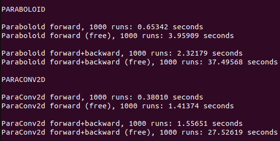

# GeoND neural network library examples.

This is a collection of examples using the GeoND neural network library.

## Version 1.1
Coming soon.

## Version 1.0
### geondpt
- [Paraboloid neuron layer on CIFAR10](https://github.com/GeoND-tech/pytorch-cifar-paraboloid).

## Performance

The performance of both the licensed and the free version of the latest version (currently 1.1) can be measured by running [this python script](https://github.com/GeoND-tech/GeoND-examples/blob/main/performance/performance.py). The output of the script in our system is:

## Licence TL;DR

Our Library is available under 3 types of license: Free, Full and Academic.

### All licenses
- Provided as-is with standard disclaimers regarding warranty and liability.
- You CANNOT modify/reverse engineer compiled binaries.
- You CAN edit python source files for internal use and deployment/integration (redistribution is still subject to the license).
### Free license
- Prohibits commercial use.
- Allows use in AI competitions, even if they include monetary or other rewards.
- Slower runtime.
- May lack some functionalities.
### Full license
- Allows commercial use.
- Faster runtime.
- Receives new features before the Free version.
- Restricts concurrent training instances per license.
- Includes an Inference library that is unrestricted and DOES NOT check for license, for deployment in, e.g., self-driving cars.
### Academic license
- Prohibits commercial use.
- Discounted price for verified institutions.
- Same as Full license otherwise.
